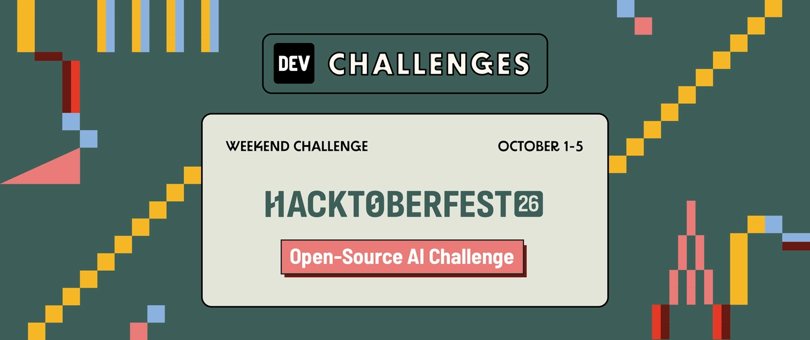
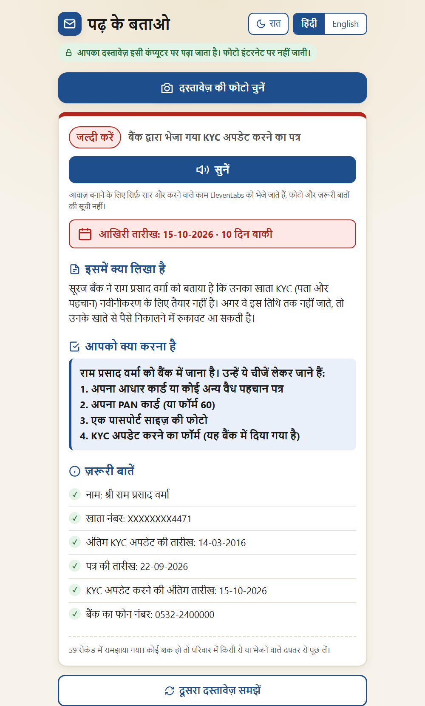
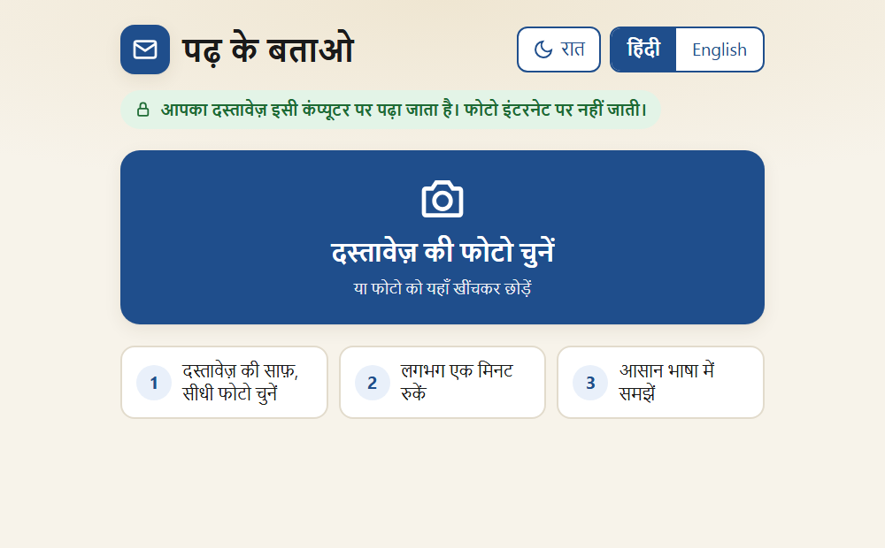
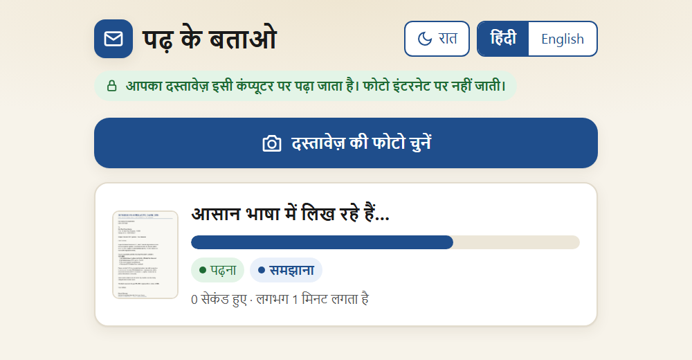
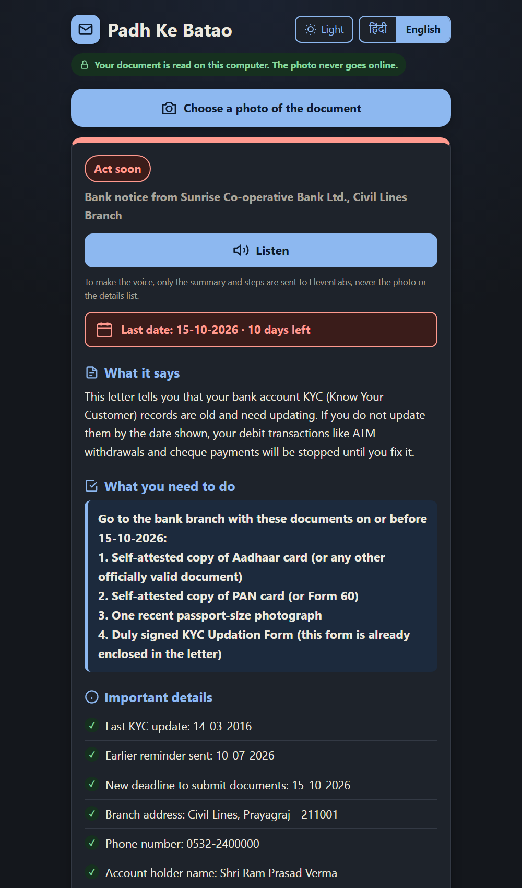
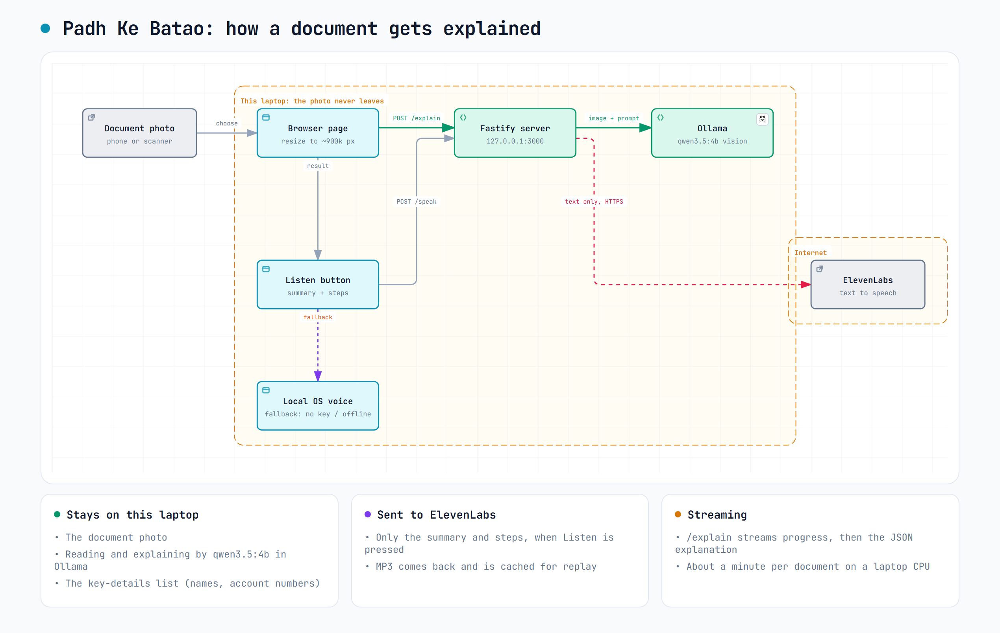

# पढ़ के बताओ · Padh Ke Batao

*Padh ke batao* (पढ़ के बताओ) is Hindi for **"read it and tell me"**: what you say when you hand someone a letter you can't fully read yourself.

**Take a photo of a document (a bank notice, hospital report, pension circular or government letter). Get it explained in simple Hindi or English: what it says, what to do, and by when.**

The reading happens on your own computer, with an open-weight vision model running in [Ollama](https://ollama.com). The photo never leaves the machine.

Built for my grandfather for DEV's [Hacktoberfest 2026 Weekend Challenge: Build for a Friend](https://dev.to/challenges/hacktoberfest-weekend-2026-10-01).



## Why

My grandfather gets a steady stream of letters he can't fully read: bank notices, hospital reports, pension circulars, government letters. They're dense, formal, often in English, and the part that matters (*do I need to do something, and by when?*) is buried in paragraph three. He usually waits until someone in the family has time to read it for him.

These letters are also some of the most private paper in the house: account numbers, health results, pension details. Sending photos of them to a cloud AI service didn't feel right, so everything that reads the document runs locally.

## What it does

- **One big button.** Choose or drag in a photo and the explanation starts.
- **Answers the questions that matter:** what kind of document it is, what it says (including what happens if you ignore it), exactly what to do, the last date, and how urgent it is.
- **Hindi or English**, switchable at any time.
- **Deadline countdown.** "15-10-2026 · 10 दिन बाकी" (10 days left), worked out by the page itself.
- **Read aloud** with the 🔊 सुनें / Listen button, using an ElevenLabs voice with a fallback to a voice installed on the computer.
- **Large text, high contrast, light and dark themes**, and a live progress bar for the roughly one-minute wait.

| Start | Working | Result (English, dark) |
|---|---|---|
|  |  |  |

*Screenshots use a made-up letter ([sample-letter.jpg](docs/images/sample-letter.jpg)); the explanations are real model output.*

## How it works

<picture>
  <source media="(prefers-color-scheme: dark)" srcset="docs/images/architecture-dark.png">
  
</picture>

*Diagram made with [archify](https://github.com/tt-a1i/archify); source in [docs/architecture.archify.json](docs/architecture.archify.json).*

1. The page shrinks the photo to about 900k pixels. That's small enough to read in about 30 seconds on a laptop CPU, and big enough for dense Hindi text to stay legible.
2. The server sends it to **`qwen3.5:4b`** (an open-weight vision model) through Ollama, with a prompt and a JSON schema that force the same six fields every time: `document_type`, `summary`, `key_details`, `action_needed`, `deadline`, `urgency`.
3. The answer streams back, so the page can show "reading…" then "writing…" instead of a frozen screen.
4. **Listen** sends only the summary and the steps to ElevenLabs. It never sends the photo or the details list, which is where account numbers live. With no ElevenLabs key, or no internet, it uses a voice installed on the computer instead.

### Why open-source AI

- **Privacy.** The document photo is processed on the laptop. There's no account, no upload and no third-party server reading bank or medical documents.
- **Works offline.** Reading and explaining the document needs no internet. The ElevenLabs voice does; without a connection, the Listen button switches to a voice installed on the computer.
- **Free to run.** No per-document cost, so he can check every document, not just the scary ones.
- **Fully tunable.** I could change the model, the sampling and the output schema until the answers were trustworthy (see below).

## Run it

You need **Node.js 22.9+**, **[Ollama](https://ollama.com/download)**, and about 8 GB of free RAM. A GPU isn't needed; this was built and tested on a CPU-only laptop (i7-13700H, 16 GB RAM, Intel Iris Xe).

```bash
# 1. Get the model (3.4 GB)
ollama pull qwen3.5:4b

# 2. Install and start
git clone https://github.com/Rahullkumr/padh-ke-batao.git
cd padh-ke-batao
npm install
npm start
```

Open **http://127.0.0.1:3000** and choose a photo of a document.

### ElevenLabs voice

```bash
cp .env.example .env
# then put your key in .env:  ELEVENLABS_API_KEY=sk_...
```

Without a key, the Listen button uses a voice installed in Windows/macOS. For Hindi on Windows, add one via *Settings › Time & language › Speech › Add voices › हिंदी (भारत)*.

### Settings

Set in `.env`. Everything except the ElevenLabs key has a default:

| Variable | Default | What it does |
|---|---|---|
| `OLLAMA_MODEL` | `qwen3.5:4b` | Any Ollama vision model |
| `OLLAMA_URL` | `http://127.0.0.1:11434` | Use `127.0.0.1`, not `localhost`: Node 22 tries IPv6 first |
| `OLLAMA_KEEP_ALIVE` | `30m` | How long the model stays loaded between documents |
| `ELEVENLABS_API_KEY` | (none) | Turns on the ElevenLabs voice |
| `ELEVENLABS_VOICE_ID` | George | Any voice from your ElevenLabs library |
| `ELEVENLABS_MODEL` | `eleven_multilingual_v2` | Must support Hindi |
| `HOST` / `PORT` | `127.0.0.1` / `3000` | The server only listens on this computer by default |

## What it took to make the answers trustworthy

I tested with six real-world documents: a bank KYC reminder, an Election Commission press note, a Hindi government message, a medical check-up report, a pension notice and a YouTube copyright email. Four rounds of fixes, each driven by an actual failure:

| Problem I saw | Fix |
|---|---|
| A harmless Hindi announcement was "explained" as a threat: *"you may be punished"*, plus an invented phone number `1234567890` | The photo was shrunk too far (768 px) for dense Devanagari. A **pixel budget (~900k)** instead of a fixed width made it read correctly |
| An English letter got an English answer in Hindi mode; others came back in Romanised Hinglish | Every field must be in the chosen language; Hindi must be **Devanagari**, with the instruction repeated in Hindi |
| Low temperature (0.2) looped and broke the JSON; high (0.7) produced odd words like अपहरण ("kidnapping") for "claimed" | **temperature 0.4**, top_p 0.8, top_k 20, and a 900-token cap so a runaway answer can't run for minutes |
| Today's date in the prompt leaked into answers as if it were in the letter | Removed. The page computes "days left" itself |
| The report date was treated as a deadline; "submit the 4 items below" with no items | Explicit rules: a printed or test date is not a deadline; write out every step and document |
| Lists of 12 details doubled the wait | At most 6 details, preferring ones you need to act on (phone numbers, amounts) over codes like IFSC |

The final prompt is in [`src/prompts/explain-document.js`](src/prompts/explain-document.js). To time any photo or try a prompt change:

```bash
npm run time -- path/to/letter.jpg hi    # or en
```

## Limitations

- **About a minute per document** on a CPU-only laptop (56–91 s in testing). A GPU makes it much faster.
- **A 4B model still makes small mistakes:** an odd word choice, a miscounted list, a transliterated name ("Sunrise" became "सूरज"). The page reminds the reader to check with family or the sender when in doubt, and it is not a substitute for reading important documents with someone you trust.
- **Not medical or legal advice.** For medical reports it explains the values printed but does not diagnose or suggest changing medicines.
- **Very blurry or tilted photos** can still be misread; a straight, well-lit photo works best.

## Project structure

```
public/                    the page (no framework, no build step)
  index.html
  css/styles.css
  js/app.js                upload, resize, streaming progress, result
  js/i18n.js               Hindi and English text
  js/speech.js             Listen button: ElevenLabs, then local voice
src/
  server.js                Fastify setup
  config.js                every setting, with defaults
  prompts/explain-document.js   the prompt and JSON schema
  services/ollama.js       calls the local model
  services/elevenlabs.js   text-to-speech
  routes/                  /explain, /speak + /config, static files
scripts/time-letter.js     time one photo from the command line
```

## Built with

[Qwen 3.5](https://ollama.com/library/qwen3.5) (open-weight vision model) · [Ollama](https://ollama.com) · [Fastify](https://fastify.dev) · [ElevenLabs](https://elevenlabs.io) (Hindi and English voice) · plain HTML, CSS and JavaScript

## License

[MIT](LICENSE) © 2026 Rahul Kumar
