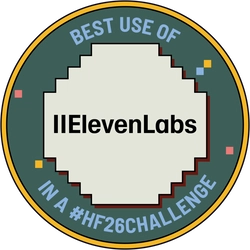
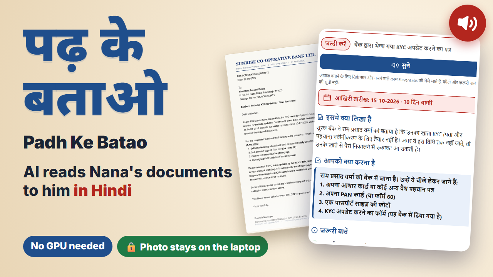

<p align="center">
  
</p>

<p align="center">🏆 <strong>Winner: Best Use of ElevenLabs.</strong> <a href="https://dev.to/devteam/congrats-to-the-hacktoberfest-weekend-challenge-build-for-a-friend-winners-pgc">See all winners</a></p></br>

# पढ़ के बताओ · Padh Ke Batao

*Padh ke batao* is Hindi for **"read it and tell me"**. It's what my Nana says whenever he hands someone a letter he can't read.

**Take a photo of a document (bank notice, hospital report, pension circular, government letter) and get it explained in simple Hindi or English: what it says, what to do, and by when.** An open-weight vision model reads it locally through [Ollama](https://ollama.com), so the photo never leaves the computer.

Built for my grandfather for DEV's [Hacktoberfest 2026 Launch Weekend DEV Challenge: Build for a Friend](https://dev.to/challenges/hacktoberfest-weekend-2026-10-01). 📝 **[Read the full story on DEV](https://dev.to/rahullkumr/padh-ke-batao-an-ai-that-reads-my-grandfathers-documents-to-him-on-a-laptop-with-no-gpu-3818)**

[](https://youtu.be/VO9MM8JvKCQ)

▶ **[Watch the demo](https://youtu.be/VO9MM8JvKCQ)** (sound on for the Hindi voice)

## Features

- **One big button.** Choose or drag in a photo and the explanation starts.
- **Answers what matters:** document type, what it says, what to do, the last date, and how urgent it is.
- **Hindi or English**, switchable any time, with a **deadline countdown** ("10 दिन बाकी").
- **Read aloud** via ElevenLabs, falling back to a voice installed on the computer.
- **Private and free.** Reading runs offline on the laptop; no account, no upload, no per-document cost.

| Start | Working | Result (English, dark) |
|---|---|---|
|  |  |  |

## How it works

<picture>
  <source media="(prefers-color-scheme: dark)" srcset="docs/images/architecture-dark.png">
  
</picture>

The page shrinks the photo to ~900k pixels and a Fastify server sends it to **`qwen3.5:4b`** in Ollama, with a JSON schema that forces six fields (`document_type`, `summary`, `key_details`, `action_needed`, `deadline`, `urgency`). The answer streams back for live progress. **Listen** sends only the summary and steps to ElevenLabs, never the photo or account details. The prompt is in [`src/prompts/explain-document.js`](src/prompts/explain-document.js).

## Run it

Needs **Node.js 22.9+**, **[Ollama](https://ollama.com/download)** and ~8 GB free RAM. No GPU needed (tested on an i7-13700H, 16 GB RAM, Intel Iris Xe).

```bash
ollama pull qwen3.5:4b
git clone https://github.com/Rahullkumr/padh-ke-batao.git
cd padh-ke-batao
npm install
npm start
```

Open **http://127.0.0.1:3000**. For the ElevenLabs voice, `cp .env.example .env` and set `ELEVENLABS_API_KEY`. Other settings (`OLLAMA_MODEL`, `OLLAMA_URL`, `PORT`, ...) and their defaults are in [`.env.example`](.env.example) and [`src/config.js`](src/config.js). To time a photo: `npm run time -- path/to/letter.jpg hi`.

## Limitations

- About a minute per document on a CPU-only laptop.
- A 4B model still makes small mistakes; check important documents with someone you trust.
- Not medical or legal advice.
- Blurry or tilted photos can be misread.

## Built with

[Qwen 3.5](https://ollama.com/library/qwen3.5) · [Ollama](https://ollama.com) · [Fastify](https://fastify.dev) · [ElevenLabs](https://elevenlabs.io) · plain HTML, CSS and JavaScript

## License

[MIT](LICENSE) © 2026 Rahul Kumar
